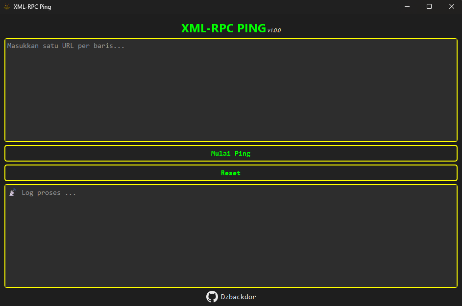

# 🛰️ XML-RPC Ping

Aplikasi ini dibuat untuk membantu para pemilik website atau blogger agar artikel mereka lebih cepat diindex oleh mesin pencari dengan cara mengirim **ping massal** ke berbagai endpoint XML-RPC aktif dan layanan feed seperti **Superfeedr**.

---

## 🧰 Fitur Utama
- ✅ Deteksi otomatis **judul artikel** dan **feed RSS**
- ✅ Dukungan ping ke:
  - XML-RPC services dll.
  - Superfeedr (PubSubHubbub)

---

## 💻 Versi EXE

### Cara menjalankan:

1. Download file `xmlping.exe` [disini](https://github.com/Dzbackdor/XML-RPC-Ping/releases)
2. Jalankan file `xmlping.exe` dengan klik dua kali.
3. Masukkan daftar URL artikel yang ingin diping.
4. Klik **Mulai Ping**.
5. Tunggu proses selesai, hasil akan muncul di log.

---

 <!-- Upload screenshot UI dan ganti nama file jika perlu -->

---
